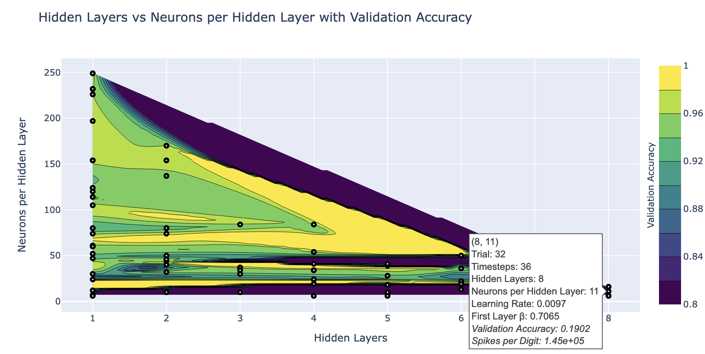

# Optunacy - alternate Optuna contour plotter

Plots Optuna contour plots trivially and with detailed mouseovers.
It collects data from all the hashes in Optuna, as well as the Objectives if you provide them.

It provides mouseovers with details, too.

## Example

```python
def optuna_objective(trial, train_loader, test_loader):
    ...
    trial.set_user_attr("Neurons per Hidden Layer", nphl)
    ...
    # The objectives have a printable name and direction
    return             validation_accuracy,   spikes_per_digit
objective_names      = ["Validation Accuracy", "Spikes per Digit"]
objective_directions = ["maximize",            "minimize"]

study = optuna.create_study(study_name="Minimize spikes, maximize accuracy",
                            directions=objective_directions)

study.optimize( lambda trial:
                optuna_objective(trial, train_loader, test_loader),
                n_trials=100)

see = OPlot(study, objective_names)
see.plot("Hidden Layers", "Neurons per Hidden Layer", "Validation Accuracy", z_clip=(0.8,1))
```



## Options
The plot function has these options:

``` python
def plot(self, 
         x_name, # string
         y_name, # string
         z_name=None,  # string
         x_range=None, # range, ex: x_range=(3,9)
         y_range=None, # range
         z_clip=None,  # Clamps colors to max and min
         interpol="linear"): # <a href="https://docs.scipy.org/doc/scipy/reference/generated/scipy.interpolate.griddata.html">interpolation method</a>
```


## Installation

```pip install optunacy```
